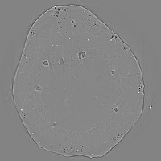

Grapevine Petiole
-----------------

Dehydration Sequence
~~~~~~~~~~~~~~~~~~~~

The Grapevine Petiole Dehydration datasets contain micro-tomography (microCT) data measuring embolisms in xylem vessels during dynamic *in-situ* dehydration, along with expert-curated ground truth semantic segmentation masks.

The datasets were acquired at the Advanced Light Source (ALS) beamline 8.3.2 in parallel beam geometry. The experimental conditions are reported in the table below:

+---------------------------------+------------------------------------+
| Instrument                      |        ALS beamline 8.3.2          |
+---------------------------------+------------------------------------+
| Energy                          |        23 keV                      |
+---------------------------------+------------------------------------+
| Monochromator                   |        Double Multilayer           | 
+---------------------------------+------------------------------------+
| Scan Range                      |        180 degree                  |
+---------------------------------+------------------------------------+
| Mode                            |        Continuous Tomo             |
+---------------------------------+------------------------------------+
| Sample Detector Distance        |        129.9 mm                    |
+---------------------------------+------------------------------------+
| Detector Name                   |        pcoEdge                     |
+---------------------------------+------------------------------------+
| Pixel Size                      |        0.635 µm                    |
+---------------------------------+------------------------------------+
| Objective Magnification         |        Optique 10x                 |
+---------------------------------+------------------------------------+
| Scintillator                    |        50 um LuAG                  |
+---------------------------------+------------------------------------+

The dataset includes 14 raw tomographic scans divided into two dynamic dehydration sequences, along with a unified archive of high-quality expert-curated segmentation masks:

*   **Expert-curated Masks**: :download:`annotations.tar.zst <https://zenodo.org/records/19476729/files/annotations.tar.zst>` - Semantic instances for 42 cross-sections (background, cortex, phloem fibers, phloem, hydrated xylem, air-filled pith, water-filled pith, dehydrated xylem, and ignore regions).
*   **Time Series 1**: 6 sequential scans of a single grapevine petiole undergoing dehydration (Petioles 22-27).
*   **Time Series 2**: 8 sequential scans of a second grapevine petiole undergoing dehydration (Petioles 33-40).

To load the datasets and perform a basic reconstruction using `tomopy <https://tomopy.readthedocs.io>`_ ::

    tomopy recon --file-name 20260221_140347_petiole23.h5 --rotation-axis 1280

+-----------------------+----------+-------------------------------------------------+----------------+
| Tomo ID               | Sequence | Sample / Filename                               | Image Preview  |
+=======================+==========+=================================================+================+
| petiole_22_           | TS1      | 20260221_135217_petiole22.h5                    | |grapevine|    |
+-----------------------+----------+-------------------------------------------------+----------------+
| petiole_23_           | TS1      | 20260221_140347_petiole23.h5                    | |grapevine|    |
+-----------------------+----------+-------------------------------------------------+----------------+
| petiole_24_           | TS1      | 20260221_140816_petiole24.h5                    | |grapevine|    |
+-----------------------+----------+-------------------------------------------------+----------------+
| petiole_25_           | TS1      | 20260221_141434_petiole25.h5                    | |grapevine|    |
+-----------------------+----------+-------------------------------------------------+----------------+
| petiole_26_           | TS1      | 20260221_141945_petiole26.h5                    | |grapevine|    |
+-----------------------+----------+-------------------------------------------------+----------------+
| petiole_27_           | TS1      | 20260221_142453_petiole27.h5                    | |grapevine|    |
+-----------------------+----------+-------------------------------------------------+----------------+
| petiole_33_           | TS2      | 20260221_154210_petiole33.h5                    | |grapevine|    |
+-----------------------+----------+-------------------------------------------------+----------------+
| petiole_34_           | TS2      | 20260221_154714_petiole34.h5                    | |grapevine|    |
+-----------------------+----------+-------------------------------------------------+----------------+
| petiole_35_           | TS2      | 20260221_155149_petiole35.h5                    | |grapevine|    |
+-----------------------+----------+-------------------------------------------------+----------------+
| petiole_36_           | TS2      | 20260221_155821_petiole36.h5                    | |grapevine|    |
+-----------------------+----------+-------------------------------------------------+----------------+
| petiole_37_           | TS2      | 20260221_160336_petiole37.h5                    | |grapevine|    |
+-----------------------+----------+-------------------------------------------------+----------------+
| petiole_38_           | TS2      | 20260221_160807_petiole38.h5                    | |grapevine|    |
+-----------------------+----------+-------------------------------------------------+----------------+
| petiole_39_           | TS2      | 20260221_161542_petiole39.h5                    | |grapevine|    |
+-----------------------+----------+-------------------------------------------------+----------------+
| petiole_40_           | TS2      | 20260221_162040_petiole40.h5                    | |grapevine|    |
+-----------------------+----------+-------------------------------------------------+----------------+

.. _petiole_22: https://zenodo.org/records/19476729/files/petiole22_raw_rec.tar.zst
.. _petiole_23: https://zenodo.org/records/19476729/files/petiole23_raw_rec.tar.zst
.. _petiole_24: https://zenodo.org/records/19476729/files/petiole24_raw_rec.tar.zst
.. _petiole_25: https://zenodo.org/records/19476729/files/petiole25_raw_rec.tar.zst
.. _petiole_26: https://zenodo.org/records/19476729/files/petiole26_raw_rec.tar.zst
.. _petiole_27: https://zenodo.org/records/19476729/files/petiole27_raw_rec.tar.zst
.. _petiole_33: https://zenodo.org/records/19476729/files/petiole33_raw_rec.tar.zst
.. _petiole_34: https://zenodo.org/records/19476729/files/petiole34_raw_rec.tar.zst
.. _petiole_35: https://zenodo.org/records/19476729/files/petiole35_raw_rec.tar.zst
.. _petiole_36: https://zenodo.org/records/19476729/files/petiole36_raw_rec.tar.zst
.. _petiole_37: https://zenodo.org/records/19476729/files/petiole37_raw_rec.tar.zst
.. _petiole_38: https://zenodo.org/records/19476729/files/petiole38_raw_rec.tar.zst
.. _petiole_39: https://zenodo.org/records/19476729/files/petiole39_raw_rec.tar.zst
.. _petiole_40: https://zenodo.org/records/19476729/files/petiole40_raw_rec.tar.zst
